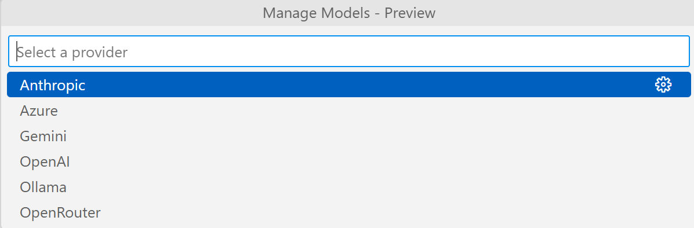

VS Code 1.99 Copilot 更新深度解读：Agent 模式登场，自定义模型成最大亮点？

大家好，我是王义杰，专注于为你带来最新的技术解读和趋势分析。

Visual Studio Code (VS Code) 作为全球开发者社区中最受欢迎的代码编辑器之一，其每一次更新都牵动着无数开发者的心弦。近日发布的 v1.99 版本，再次将焦点对准了其内置的 AI 编程助手——GitHub Copilot。这次更新带来了备受关注的 **Copilot Agent 模式**，并且，或许更具战略意义的是，**正式支持用户配置自己的大语言模型（LLM）API Key**，覆盖了从 流行供应商 到本地部署 Ollama 的广泛选择。

这不仅仅是一次功能迭代，更可能预示着 AI 辅助编程工具未来的发展方向。让我们深入探讨一下这次更新的看点和它对开发者意味着什么。

### Copilot Agent 模式：姗姗来迟，但意义重大

首先，我们来看看 Copilot Agent 模式。根据 VS Code 的 [官方更新日志 v1.99]()(https://code.visualstudio.com/updates/v1_99)，Agent 模式旨在让 Copilot 拥有更深层次的项目理解能力和执行更复杂任务的能力，例如跨文件代码分析、项目级重构建议、甚至根据需求生成测试用例等。

**具体示例：** 想象一下，我们不再是简单地要求 Copilot 补全当前行的代码，而是可以提出更宏观的需求，比如：“帮我分析 `src/utils` 目录下所有工具函数的潜在性能瓶颈”，或者“为 `UserService` 类中的 `createUser` 方法生成集成测试”。Agent 模式理论上能更好地理解这些上下文关联的任务。

**实用建议：** 对于开发者而言，这意味着 Copilot 不再仅仅是一个“自动补全”工具，而是向一个更智能的“编程伙伴”迈进。尝试在我们的工作流中引入 Agent 模式，处理那些需要跨文件理解或涉及项目整体结构的任务，可能会带来效率上的提升。

**不过，正如一些敏锐的开发者指出的那样，Agent 模式的概念并非 VS Code 首创。** 像 Cursor 这样的 AI-First 编辑器早已将类似的功能作为其核心卖点。从这个角度看，VS Code 的 Agent 模式更像是对市场趋势的一种“跟进”和“整合”。然而，考虑到 VS Code 庞大的用户基数和成熟的生态系统，将 Agent 模式无缝集成到数百万开发者熟悉的界面中，其影响力不容小觑。这使得先进的 AI 功能更容易被广泛采纳。

### 自定义模型支持：真正的“开发者友好”升级

在我看来，**v1.99 中最激动人心的更新，莫过于允许用户配置自己的 LLM API Key**。这一功能直接命中了当前 AI 工具使用中的几个核心痛点：成本、选择权和隐私。

VS Code 现在支持接入多种模型提供方，包括：
*   **OpenAI:** 使用我们的 OpenAI API Key，可以选择不同的 GPT 模型。
*   **Azure:** 面向企业用户，提供 Azure 平台上的 OpenAI 服务。
*   **Gemini:** 超长上下文的大模型，风头正劲。
*   **Athropic:** 提供最受好评的编程大模型。
*   **OpenRouter:** 做热门的聚合大模型提供商，提供几乎所有热门的大模型。
*   **Ollama:** 这点尤为关键！Ollama 使得在本地运行开源大模型变得异常简单。

**为什么这如此重要？**

1.  **成本控制与灵活性：** 我们不再局限于 Copilot 默认的模型和订阅费用。可以利用各大平台提供的免费额度（如 OpenAI API 的试用额度），或者选择性价比更高的模型。对于需要大量使用 AI 的场景，这可能意味着显著的成本节约。
2.  **模型选择权：** 不同的模型各有优劣。也许我们发现某个特定模型在生成 Python 代码时表现更佳，而另一个模型更擅长解释复杂的 C++ 概念。现在，我们可以根据任务需求灵活切换。
3.  **隐私与安全：** 通过 Ollama 支持本地模型，开发者可以在完全离线的环境中处理敏感代码，无需将代码片段发送到云端服务器。这对于注重数据安全和隐私的企业或个人开发者来说，是一个巨大的福音。
4.  **拥抱开源与定制：** 支持 Ollama 也意味着对开源社区的拥抱。开发者可以轻松尝试各种优秀的开源模型，甚至未来可能接入自己微调过的、更符合特定领域需求的模型。

**实用建议：**
*   如果我们对成本敏感，可以研究下不同平台 API 的定价和免费额度。
*   如果我们处理的代码涉及商业机密或个人隐私，强烈建议尝试配置 Ollama 运行本地模型。下载一个轻量级的模型（如 `llama3` 或 `codegemma` 的小参数版本），在本地就能获得不错的 AI 辅助体验。
*   对于追求极致性能或特定任务优化的开发者，可以关注 Athropic 或尝试不同的 OpenAI 模型版本。

**引用可靠来源：** VS Code 官方文档和更新日志是了解具体配置方法和支持列表的最佳途径。同时，Ollama 的官方网站 ([https://ollama.com/](https://ollama.com/)) 提供了安装和运行模型的详细指南。

**不足**：经检查测试，我发现代码补全的模型选择仍然之有chagpt-4o。

### 战略意义：巩固生态，顺应趋势

从战略层面看，VS Code 的这一系列更新，尤其是自定义模型的支持，是一次非常明智的举动：

*   **应对竞争：** 像 Codium、Cursor、cline 等竞品，以及 JetBrains AI 等，都在 AI 功能上积极创新。特别是允许用户选择不同模型或提供更灵活方案的工具，对开发者有很强的吸引力。VS Code 通过开放模型选择，有效地削弱了竞品在这方面的独特优势，将用户留在自己的生态系统内。
*   **与时俱进：** AI IDE 的发展趋势显然是更加开放、可定制和以开发者为中心。允许“自带模型”（Bring Your Own Model, BYOM）正是这一趋势的体现。VS Code 抓住了这个趋势，展现了其持续进化的决心。
*   **开发者友好：** 这一更新将选择权交还给开发者，满足了不同层次的需求（从免费试用到本地部署），这无疑是“开发者友好”的最佳诠释。

### 结论：拥抱变化，未来可期

VS Code v1.99 的 Copilot 更新，虽然 Agent 模式的“新颖性”可能因 Cursor 等先行者而有所折扣，但其**开放自定义模型接入的能力，无疑是本次更新中最具变革性的亮点**。它不仅极大地增强了 Copilot 的灵活性和适用性，降低了使用门槛（尤其是通过 Ollama），也顺应了 AI 工具个性化、开放化的发展大潮。

这一步棋让 VS Code 在日益激烈的 AI 辅助开发工具竞争中，再次巩固了自己的领先地位。对于我们开发者而言，这意味着更多的选择、更低的成本和更好的隐私保护。现在，是时候去探索这些新功能，看看它们如何能进一步提升我们的开发效率和体验了！

**你对 VS Code 这次 Copilot 的更新有什么看法？你最期待尝试哪个功能？欢迎在评论区留言分享你的想法！**