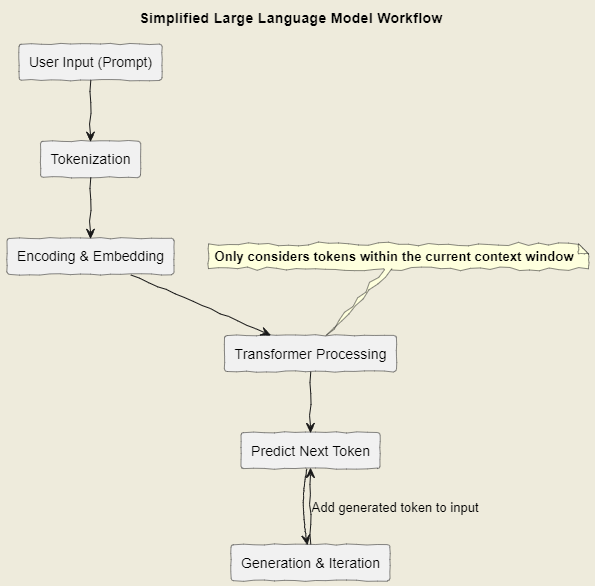

揭秘大模型的心脏：主流架构与上下文窗口解析

最近，大语言模型（LLM）的热度可以说是一浪高过一浪，从 ChatGPT 4.5 到 Gemini 2.5，再到各种开源模型如 Llama3、Mistral，它们强大的能力让人惊叹。但你是否好奇，这些聪明的“大脑”内部是如何工作的？特别是像“上下文窗口”、“输入长度”这些概念，它们到底意味着什么？

今天，就让我们一起掀开大模型的神秘面纱，深入了解当前主流的大模型架构，并重点解析“上下文窗口”这一关键概念。

### 一、基石：Transformer 架构

谈及现代大模型，我们绕不开一个里程碑式的架构——**Transformer**。自 2017 年 Google 在论文《Attention is All You Need》中提出以来，Transformer 凭借其独特的 **自注意力机制（Self-Attention）** 和并行处理能力，迅速取代了早期流行的 RNN（循环神经网络）和 LSTM（长短期记忆网络），成为了大模型领域的绝对主流。

**为什么 Transformer 如此重要？**

1.  **捕捉长距离依赖：** 传统的 RNN 在处理长序列时容易“遗忘”前面的信息。而 Transformer 的自注意力机制允许模型在处理每个词时，直接关注输入序列中的所有其他词，并计算它们之间的相关性权重。这使得模型能更好地理解词语之间的长距离依赖关系，例如，“我把苹果放在了桌子上，然后把它吃了”，“它”指代的是“苹果”，即使两者之间隔了几个词，Transformer 也能有效捕捉。
2.  **并行计算能力：** Transformer 摆脱了 RNN 的顺序处理限制，其自注意力计算可以高度并行化，极大地提高了训练效率，使得训练更大规模的模型成为可能。

**Transformer 核心组件（简化理解）：**

*   **词嵌入（Embeddings）：** 将输入的文字（Token）转换成模型能够理解的数字向量。
*   **位置编码（Positional Encoding）：** 由于 Transformer 本身不处理序列顺序，需要加入位置信息，告诉模型每个词在句子中的位置。
*   **多头自注意力（Multi-Head Self-Attention）：** 这是 Transformer 的核心，模型从不同角度（多个“头”）关注输入序列的不同部分，学习词与词之间的复杂关系。
*   **前馈神经网络（Feed-Forward Network）：** 对自注意力层的输出进行进一步的非线性变换和处理。

![一个简化的 Transformer 结构示意图可能在这里会很有帮助]

### 二、主流架构分支：Encoder-Decoder 与 Decoder-Only

基于 Transformer，目前主流的大模型架构主要可以分为两大类：

1.  **Encoder-Decoder 架构（编码器-解码器）**
    *   **代表模型：** T5, BART, 早期 Transformer 应用（如 Google Translate）
    *   **工作方式：** 这种架构包含两个部分。**编码器（Encoder）** 负责读取并理解整个输入序列，生成一个包含输入信息的中间表示（context）。然后，**解码器（Decoder）** 利用这个中间表示，并结合已经生成的部分输出，逐步生成目标序列。
    *   **形象比喻：** 就像一个专业的翻译员，先完整阅读并理解源语言句子（Encoder），然后在脑中形成含义（中间表示），最后用目标语言一句一句地表达出来（Decoder）。
    *   **适用场景：** 非常适合需要完整理解输入再生成输出的任务，如机器翻译、文本摘要、问答（需要基于给定文本回答）。

2.  **Decoder-Only 架构（仅解码器）**
    *   **代表模型：** GPT系列（GPT-3, GPT-4）, Llama系列, Mistral, PaLM, Gemini (部分能力基于此)
    *   **工作方式：** 这种架构只使用 Transformer 的解码器部分。它接收一段文本（通常称为 Prompt），然后基于这段文本，自回归地（autoregressively）预测下一个最可能的词（Token），并将预测出的词添加到输入序列中，继续预测下一个词，直到生成完整的回复或达到停止条件。
    *   **形象比喻：** 像一个即兴演讲者或故事续写者，根据我们给出的开头（Prompt），不断地思考接下来最应该说什么，一个词一个词地往下接。
    *   **适用场景：** 极其擅长文本生成、对话系统、代码生成、创意写作等任务。目前最火热的聊天机器人大多采用此架构。

**为什么 Decoder-Only 近期更受关注？**
Decoder-Only 架构在生成连贯、流畅的文本方面表现出色，并且其结构相对简单，更易于扩展到巨大的参数量。对于追求通用对话和生成能力的模型来说，它被证明非常有效。

### 三、关键概念：上下文窗口（Context Window）

现在我们来谈谈“上下文窗口”（Context Window），这绝对是大模型的核心概念之一。

*   **什么是上下文窗口？**
    上下文窗口，通常也指 **输入上下文窗口（Input Context Window）**，定义了模型在一次处理（预测下一个词时）能够“看到”或“考虑”的 **最大输入文本长度**。这个长度通常以 **Token**（可以理解为词或子词）的数量来衡量。

*   **为什么它如此重要？**
    想象一下和人对话，如果对方只能记住我们说的最后两句话，那对话肯定很难进行下去。上下文窗口就是模型的“短期记忆”容量。
    *   **决定信息处理量：** 它直接限制了我们能一次性输入给模型的文本量。如果我们的文档或对话历史超过了模型的上下文窗口，模型就无法同时处理所有信息，可能会“忘记”开头的内容。
    *   **影响任务表现：** 对于需要理解长篇文档、保持长时间连贯对话、或基于大量背景知识进行推理的任务，上下文窗口的大小至关重要。窗口太小，模型能力会受限。

*   **具体例子：**
    *   早期的 GPT 模型上下文窗口可能只有 2048 个 Token。
    *   GPT-3.5 系列常见的有 4K（4096）或 16K（16384）Token 的版本。
    *   GPT-4 则提供了 8K、32K 甚至 128K Token 的版本。
    *   Anthropic 的 Claude 模型更是推出了 100K 甚至 200K Token 的超长上下文窗口。
    *   开源模型如 Llama 2 基础是 4K，Mistral 有 8K 或 32K 版本，一些新模型也在不断扩展这个长度。

*   **扩展上下文窗口（Extended Context Window）**
    这正是当前大模型研究的热点方向！研究人员和工程师们正在努力通过各种技术（如 RoPE 缩放、注意力机制优化、更好的位置编码方法等）来扩大模型的上下文窗口，同时尽量保持模型的性能和效率。
    *   **目标：** 让模型能处理整本书、完整的代码库或非常长的对话历史。
    *   **挑战：** 扩展上下文窗口通常会带来巨大的计算和内存开销（注意力机制的计算复杂度与序列长度的平方相关），并且可能导致模型在处理长序列时性能下降（所谓的“迷失在中间”现象）。

### 四、大模型工作流程（简化版）

结合以上概念，一个典型的 Decoder-Only 大模型（如 ChatGPT）处理你的请求大致是这样的：

### 五、实用建议与思考

理解这些架构和概念对我们有什么帮助？

1.  **选择合适的模型：** 如果我们的任务是翻译或摘要，Encoder-Decoder 模型可能更优。如果是聊天或内容生成，Decoder-Only 是主流选择。
2.  **优化 Prompt：** 了解上下文窗口限制，可以帮助我们设计更有效的 Prompt。如果信息过多，考虑分块输入或进行摘要。确保最重要的信息在模型的“注意力范围”内（通常靠后放更有效）。
3.  **评估模型能力：** 模型声称的上下文窗口大小是一个重要指标，但实际能在多长的上下文中保持高性能是另一回事。测试很重要。
4.  **关注前沿进展：** 扩展上下文窗口、优化注意力机制、探索新架构（如 Mamba 代表的状态空间模型）是 LLM 领域的热点，持续关注能让我们把握未来趋势。

### 结语

大语言模型的世界复杂而迷人。Transformer 架构奠定了基础，Encoder-Decoder 和 Decoder-Only 架构各有侧重，而上下文窗口则是衡量模型“记忆力”和信息处理能力的关键标尺。理解这些核心概念，就像获得了地图和指南针，能帮助我们更好地驾驭这些强大的 AI 工具，探索它们能力的边界。