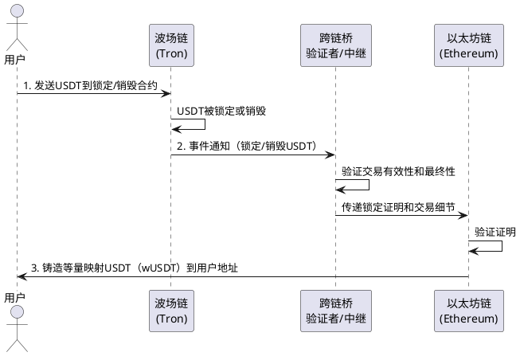

跨链风云：打破区块链孤岛，实现价值自由流转

嘿，各位技术爱好者们！今天我们来聊一个区块链领域非常火热且至关重要的话题——**跨链技术**。你可能听说过，比如想把在波场（Tron）链上的USDT转移到以太坊（Ethereum）网络上，这个过程就涉及到跨链。 听起来是不是就像在两个独立的国家之间转移资产，需要复杂的协议和高度的信任？没错，这背后确实隐藏着精妙的技术和对一致性的极致追求。

### 为什么我们需要跨链？区块链世界的“巴别塔”困境

在早期，不同的区块链就像一座座孤岛，各自拥有独立的生态系统和规则。比特币网络专注于点对点的电子现金系统，而以太坊则以其强大的智能合约功能开启了去中心化应用（DApp）的时代。 之后，各种新的公链、联盟链、私有链如雨后春笋般涌现，它们在共识机制、编程语言、虚拟机等方面各不相同。

这种“百花齐放”的局面虽然带来了创新，但也导致了**“价值孤岛”**和**“数据孤岛”**的问题。 用户在一条链上的资产或数据很难方便、安全地转移到另一条链上使用，这极大地限制了区块链技术的应用广度和深度。想象一下，如果你的银行存款只能在特定的城市使用，那将是多么不便！

跨链技术的出现，正是为了打破这些壁垒，实现不同区块链之间的**互操作性**（Interoperability），让数字资产和信息能够自由、安全地在不同的区块链网络中流转。

### 跨链是如何实现的？揭秘核心技术原理

实现跨链，尤其是像将波场上的USDT转移到以太坊这种异构链之间的资产转移，确实需要精巧的设计。其核心挑战在于如何确保在一条链上资产的“消失”（锁定或销毁）和在另一条链上对应资产的“出现”（解锁或铸造）是一个**原子操作**，也就是说，要么同时成功，要么同时失败，绝不能出现资产丢失或被双重花费的情况。 此外，还需要保证跨链过程中数据的**一致性**和**可验证性**。

目前主流的跨链技术方案主要有以下几种：

1.  **公证人机制（Notary Schemes）**:
    *   **原理**：引入一个或一组可信的第三方（公证人）作为中介。 这些公证人负责监听源链上的特定事件（例如，用户将USDT存入特定地址），并在验证通过后，在目标链上执行相应的操作（例如，在以太坊上铸造等量的映射USDT）。
    *   **示例**：很多中心化交易所提供的跨链充提币服务，就可以看作是一种广义上的公证人机制。 交易所作为那个可信第三方。
    *   **优缺点**：实现相对简单，易于理解。但其中心化或半中心化的特性，引入了信任风险和单点故障的可能性。

2.  **侧链/中继链（Sidechains/Relays）**:
    *   **原理**：
        *   **侧链**：是一种与主链平行的独立区块链，它通过双向锚定（Two-way Peg）机制与主链相连，允许资产在主链和侧链之间转移。
        *   **中继链**：则更像一个“交通枢纽”，它本身不处理太多应用逻辑，而是专注于连接不同的区块链（平行链或区域），并验证它们之间的状态和消息传递。 Polkadot和Cosmos是采用中继链模式的典型代表。
    *   **示例**：在波场USDT转移到以太坊的场景中，可能会有一个中继网络或者一个特定的“桥”合约。用户在波场链上将USDT锁定到一个合约中，中继者监听到这个事件并验证后，在以太坊链上相应的合约中铸造出等量的“封装USDT”（Wrapped USDT）。
    *   **优缺点**：侧链和中继链模式在去中心化程度上有所提升，并且能够支持更复杂的跨链交互。但其设计和实现复杂度较高，对网络的健壮性和安全性要求也更高。

3.  **哈希时间锁定合约（Hashed Timelock Contracts, HTLCs）**:
    *   **原理**：这是一种更去中心化的点对点跨链资产交换方式，常用于原子交换（Atomic Swaps）。 交易的双方在各自的链上锁定资产，并设置一个哈希锁和一个时间锁。接收方需要在规定时间内提供一个密码（原像），才能解锁另一方的资产，同时自己的资产也会被对方解锁。如果超时，交易将自动取消，资产退回原主。
    *   **示例**：虽然HTLC更多用于不同原生代币之间的原子交换，但其原理也可以扩展到更复杂的跨链场景中，确保交易的原子性。
    *   **优缺点**：高度去中心化，无需信任第三方。但主要适用于资产交换场景，对于更通用的数据和消息传递支持有限，且受限于区块链的确认时间和交易成本。

**以波场USDT转移到以太坊为例的简化流程（通常通过跨链桥实现）：**

> **说明：**  
> - 用户在波场链上锁定或销毁USDT，跨链桥验证者监听并验证事件，将证明传递到以太坊链。  
> - 以太坊链上的合约收到证明后，铸造等量的映射USDT（如wUSDT）给用户。

反向操作（从以太坊转回波场）则类似，用户在以太坊上销毁映射USDT，验证者确认后，在波场链上解锁原始的USDT。

### 跨链并非坦途：挑战与风险并存

尽管跨链技术带来了巨大的想象空间，但它依然面临诸多挑战和风险：

*   **安全性**：跨链桥是黑客攻击的重灾区。智能合约的漏洞、私钥管理不当、验证者作恶等都可能导致用户资产的巨大损失。 “深度防御”和多层安全机制是未来跨链安全的重要方向。
*   **一致性与原子性**：确保跨链操作的原子性和最终一致性是技术上的核心难点。 网络延迟、分叉等都可能导致状态不一致。
*   **复杂性**：不同的跨链方案有其自身的复杂性，理解和实施门槛较高。
*   **流动性碎片化**：资产在不同的链和跨链桥之间流转，可能导致流动性被分散。
*   **信任模型**：不同的跨链方案依赖不同的信任模型，从完全信任第三方到密码学信任，用户需要仔细甄别。

### 给用户的实用建议

作为普通用户，在使用跨链服务时，可以注意以下几点：

1.  **选择信誉良好的跨链桥**：优先选择经过安全审计、社区认可度高、有成熟运营经验的跨链桥。
2.  **了解其工作原理和风险**：花时间了解你所使用的跨链桥是如何运作的，以及潜在的风险点。
3.  **小额测试**：在进行大额跨链操作前，先用小额资产进行测试，确保流程顺畅且符合预期。
4.  **注意手续费和滑点**：跨链操作通常会产生手续费，不同链和桥的费率不同。 在流动性不足时，还可能产生较高的滑点。
5.  **保管好自己的私钥**：无论在哪条链上操作，保护好自己的钱包私钥是第一要务。
6.  **关注官方渠道信息**：留意跨链项目方的官方公告，及时了解安全更新和潜在风险提示。
7.  **考虑通过中心化交易所中转**：对于一些主流资产，通过大型、信誉良好的中心化交易所进行不同链之间的充提，有时可能是一种更简单、成本更低且相对安全的选择，尤其是在交易所支持目标链的情况下。

### 总结与展望：迈向价值互联网的基石

跨链技术是区块链从“孤岛”走向“互联互通”的关键，是构建未来“价值互联网”不可或缺的基础设施。 尽管目前仍面临诸多挑战，但随着技术的不断迭代和完善，我们可以期待未来跨链交互会变得更加安全、高效和便捷。

从波场USDT到以太坊的简单转移，背后是无数开发者对协议一致性和安全性的不懈追求。理解这些基本原理，不仅能帮助我们更好地使用这些工具，更能让我们洞察区块链技术发展的宏大图景。

---

**插图提示词：**

一个由多条不同颜色、不同纹理的河流（代表不同的区块链）组成的网络，河流之间通过设计精巧、发光的桥梁（代表跨链桥）连接起来。桥梁上有数据流和象征价值的符号（如金币、代币图标）在顺畅地双向流动。整个画面体现出互联互通、高效流转的科技感和未来感。