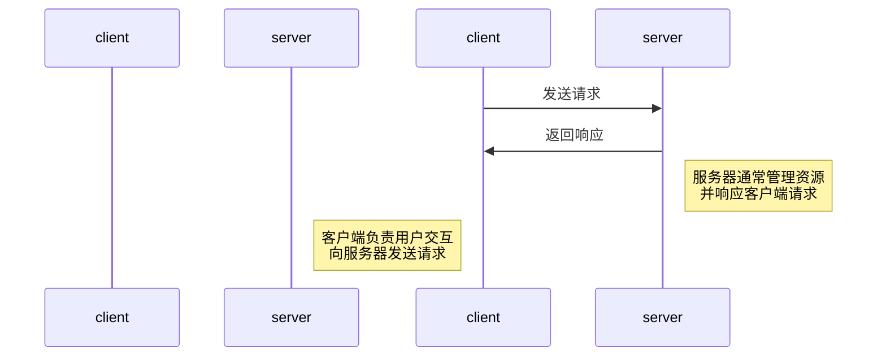

引言与算法概览

算法的定义与重要性

时间复杂度和空间复杂度概念

排序算法

冒泡排序

选择排序

插入排序

归并排序

快速排序

查找算法

二分查找

线性查找

第二部分：数据结构
线性数据结构

数组

链表

栈与队列

树形数据结构

二叉树

AVL树

红黑树

图形数据结构

图的概述

图的遍历：深度优先搜索与广度优先搜索

第三部分：高级算法
动态规划

背包问题

斐波那契序列优化

最长公共子序列

贪心算法

霍夫曼编码

Kruskal最小生成树

字符串算法

KMP算法

Manacher算法

第四部分：实际应用与实践
算法在现实生活中的应用

搜索引擎

人工智能

算法面试技巧

面试中常见的算法问题

解题思路和技巧分享

项目实践

实现一个小型搜索引擎

构建自己的数据结构库